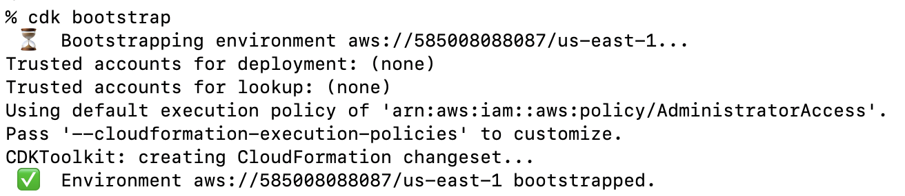

{{ page.title }}
================

21st July 2025 - NW

Say you manage a SaaS platform that accesses customer's accounts using sts:AssumeRole. There's lot's of sharp edges around
managing this kind of platform in AWS, however you've done your research and know about the confused deputy problem and how
to prevent it.

Your IaC code is full of hacks to get terraform to do weird things and recently you've pushed out an CI/CD pipeline
which you'll use to slowly start migrating infrastructure over to AWS CDK.

Notice anything wrong here? There is an critical unauthenticated vulnerability in the highly privileged SaaS platform account
in this configuration.

As soon as this CI/CD pipeline is ran for the first time it will silently create an
IAM role with a root principal trust, which can be enumerated and used by an attacker to onboard, then access or modify
your AWS account through the capabilities of your own SaaS platform.

This may sound a bit surprising, so in this post I'll cover when exactly this vulnerability can occur, how to test 
for it as a pentester or bug bounty hunter, and how to defend against it.

So far I haven't seen anyone document this specific attack yet so I believe this post is the first, however, if you're aware of
any previous research here let me know!

## Root Cause

I used AWS CDK as an example because it was the most commmon IAM Role type I found in my testing that lead to the SaaS platform
being vulnerable to this attack. More specifically, this attack is possible when any IAM role in the SaaS provider's AWS 
account is configured to trust the root principal of the same account, and does not explicitly implement sts:ExternalID protections.

This is a very common configuration, you'll likely see it when you need to create an IAM Role for more then one person. It is also
created when you use any of the following tools:

* [AWS CDK](https://github.com/aws/aws-cdk)
* [AWS Landing Zone Accelerator](https://github.com/awslabs/landing-zone-accelerator-on-aws)
* [Copilot CLI](https://github.com/aws/copilot-cli)
* [Amplify V1](https://github.com/aws-amplify/amplify-cli)
* [Amplify V2](https://github.com/aws-amplify/amplify-backend)

The full list of tools is fairly long, and to make it worse they do not include any warning that this kind of role is being created. If
anyone has ever ran `cdk bootstrap` in the SaaS provider account, then this attack is possible, 

it's the path of least resistence when creating IAM Role's that will be

and is what I consider the default (1) configuration when creating an IAM role in the IAM Web
console.

(1). 

The root cause of this vulnerability is 

I also want to quickly call out that I've discovered and reported this 

 have succesfully tested and reported this on several SaaS platforms. 
to the apI've reported 
so far is either fixed or the company is intentionally

by anyone else so this may  across anyone else talking about this

Just a quick blog post here, recently I've been trying to open-source some of my projects. One of these was the GoLang
tool [roles](https://github.com/RyanJarv/roles/blob/main/README.md) for unauthenticated role scanning.

If you're not familiar with this technique you can read up on it on [hackingthe.cloud](https://hackingthe.cloud/aws/enumeration/enum_iam_user_role/).
But in short, it was first described by Daniel Grzelak in 2016 and is pretty much what it sounds like, an unauthenticated
enumeration of IAM Principals. You can't view any details about the role, but it allows you to test if a given principal
exists or not in a specific account. This doesn't sound like much, but can reveal interesting details about software
used by a particular target or even indicate the presence of a possible vulnerability leading to unauthenticated
access to the AWS Account, something I'll cover in depth in a future blog post. You can get an idea of what roles 
other's might be able to see in your account by checking out [awseye.com](https://awseye.com) it uses this technique 
along with a few other's to identify resource's used by a given AWS account.

The other well-known tool for scanning unauthenticated principals that I'm aware of is [quiet-riot](https://github.com/righteousgambit/quiet-riot)
which can achieve testing 1,170 principals/sec. Despite being able to achieving this throughput, it is written in Python
which is difficult to write high-performance code with. This got me a bit curious about what the 
upper limit might be for a similar tool written in GoLang.

Originally, [roles](https://github.com/RyanJarv/roles/blob/main/README.md) wasn't intended to be fast, I worked
on it, because I wanted a few features like caching and variable interpolation in role names, and secondly I often find it
easier to hack on a purpose-made tool I built myself than use a more generic one already available that supports
features I may not need at the moment.

I started this minor-rewrite by ensuring setup and enumeration were run separately. The account optimization process is
run by passing `-setup` and enables all available regions then pre-creating the resources needed by each thread
later for enumeration. I also added a [plugin interface](https://github.com/RyanJarv/roles/blob/aab41f059c761049a057fd04efe40da768efbae1/pkg/plugins/types.go#L10)
and [documented it](https://github.com/RyanJarv/roles/tree/main?tab=readme-ov-file#plugins) so that ChatGPT could create
new methods of enumeration in case I ended up hitting account limits on a specific API call. However, the key thing here
was running a few goroutines for each plugin, in each region.

With this I was able to hit about 2k tests/second per second. I think I may have assumed the quiet riot benchmarks where 
in a single account, so originally I was a bit un-impressed with this and decided to see if using a dedicated AWS 
organization was any faster. in hindsight this was already quite a bit faster considering I only used one account for 
this initial benchmark.

For the org test I started by registering a new AWS account and started adding the `-org` setup mode. This enabled AWS 
Organizations in the account, created as many sub-accounts as allowed, and ran the account level setup on each. By 
default, you can only create 9 sub-accounts, so along with the root account the organization mode used 10 accounts in a 
similar setup as before, which resulted in about 10 times the throughput for a total of 20k principal tests/second.

These tests weren't perfect, the stats code was originally broken, and out of a bit of caution, I ended up disabling
three of the five plugins and reducing the concurrency during the org testing to 1/5th the optimal account settings.
It's actually a bit surprising it worked out to just about 10 times after adjusting for the broken stats code, 
considering I reduced the concurrency quite a bit in the org test. In any case, it seems scanning at 20k tests/second 
for short durations (up to 20 seconds) is possible. And secondly, GoLang is awesomely fast.

Edit: Lets go with ~13.5k /sec, looking at the stats code again it didnt need to be adjusted. This makes a bit more sense too. 

One question I still have though is how API limiting works on these API actions, if they use a token bucket rate
limiter these short-duration tests may not mean that much since the bucket is usually refilled slowly over some duration
of time. Either way, I thought this was interesting and wanted to share the results even if it wasn't exactly a
completely accurate benchmark.

## Roles Tool

If you want to use the tool you can find it on my GitHub [here](https://github.com/RyanJarv/roles), however, it's
currently rate-limited to a maximum of 50 requests per second, and the org-mode is not supported at the moment. Using
the APIs in this way is a bit of a corner case, and while it's important to know what's possible, it may be in your
best interest to avoid going much faster than these limits for an extended period.

The tool also supports caching and role name interpolation for variables like the Account ID and Region. At some point,
I'd like to support more advanced wordlist options, if you're interested in working on that feel free to ping me or open
a PR!
