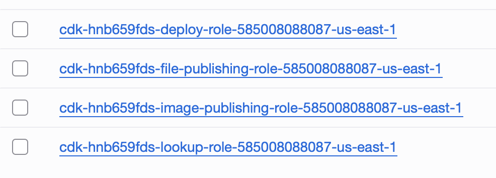
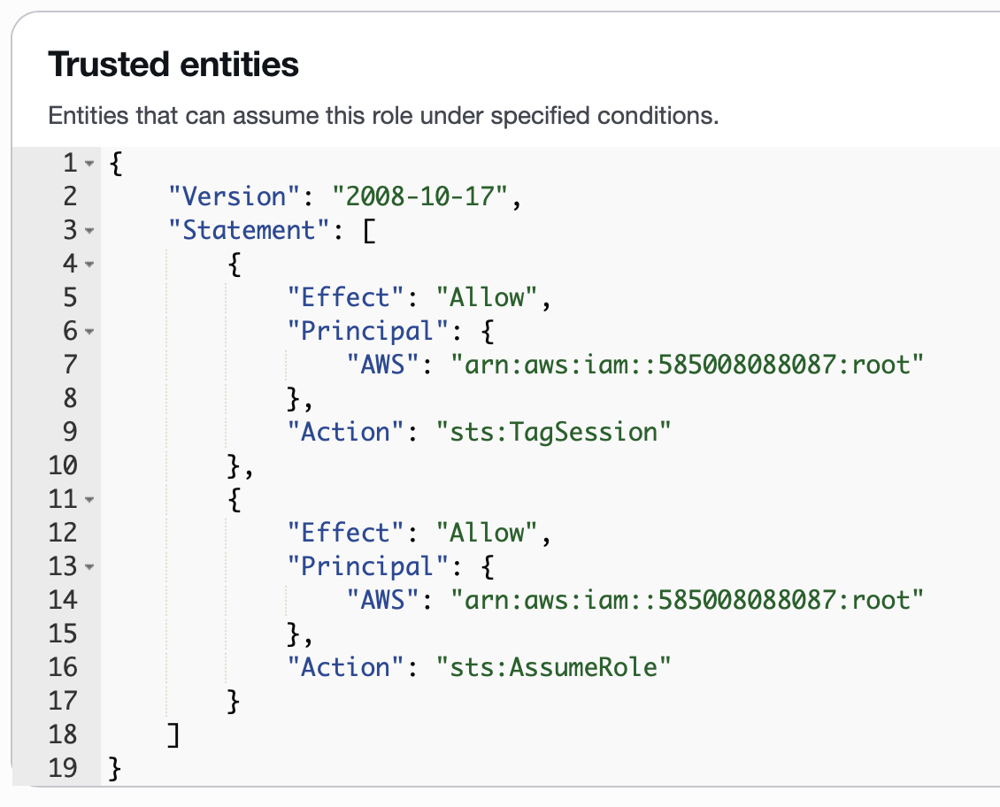

{{ page.title }}
================

21st July 2025 - NW

Imagine for a moment you manage a SaaS platform that accesses customer's accounts using sts:AssumeRole. There's lot's of 
sharp edges around managing this kind of infrastrucutre in AWS, however, you've done your research and know about the 
confused deputy problem and how to prevent it.

Your IaC code is full of hacks to get terraform to do weird things and recently you've pushed out an CI/CD pipeline
which you'll use to slowly start migrating infrastructure over to AWS CDK.

Notice anything wrong here? It doesn't seem like much, but I've already described all of the requirements needed for an 
attacker to exploit the critical unauthenticated vulnerability I'll be covering in this blog post. This vulnerability affects 
the highly privileged SaaS platform AWS account, the same account that is used to access all customer AWS accounts in this 
example.

## The Problem

AWS CDK requires you to bootstrap each environment that you will be deploying infrastructure to. You can either let this step
run automatically in the first CI/CD run or run it manually with `cdk bootstrap`:

You can see above that this deployed a CloudFormation template, which ended up creating a set of four IAM roles with 
permissions varying from full Read Only to Administrative access via CloudFormation.

And if you look at the trust policies for these four roles you'll notice that each one is configured to trust the current
account's root principal:

For most account's this is a reasonable default, since typically only trusted users will have the required `sts:AssumeRole`
permission in their identity policy.

However, as a SaaS provider using `sts:AssumeRole` to access customer's accounts, the threat model get's flipped upside down
because we have an IAM role with full `sts:AssumeRole` access that we allow unauthenticated users partial control over. During
onboarding, the user can provide arbitrary role ARNs that the SaaS application attempts to assume. If the AWS API call is 
successful, the user owns the target AWS account as far as the app is concerned. Authentication is effectively controlled 
by the target role, and if the session external ID, which is not user controllable matches the external ID in the trust policy.

So reviewing the current state of the account:

* Our partially untrusted application role has full `sts:AssumeRole` permissions in the identity policy.
* The CDK roles trust the current account's root principal, allowing access from any principal with appropriate `sts:AssumeRole` permissions (i.e. our untrusted role).
* The CDK roles do not implement `sts:ExternalID` protections since they aren't useful for the indended use case of these IAM Roles.

This means the attacker can simply claim to own any of the CDK roles above and everything will just work (tm). The app now thinks the attacker now owns the SaaS providers AWS account.

I used AWS CDK as an example because it was the most commmon IAM Role type I found in my testing that lead to the SaaS platform
being vulnerable to this attack. More specifically, this attack is possible when any IAM role in the SaaS provider's AWS 
account is configured to trust the root principal of the same account, and does not explicitly implement sts:ExternalID protections.

This is a very common configuration, you'll likely see it when you need to create an IAM Role for more then one person. It is also
created when you use any of the following tools:

* [AWS CDK](https://github.com/aws/aws-cdk)
* [AWS Landing Zone Accelerator](https://github.com/awslabs/landing-zone-accelerator-on-aws)
  * I believe this deploys CDK to all accounts in an org.
* [Copilot CLI](https://github.com/aws/copilot-cli)
* [Amplify V1](https://github.com/aws-amplify/amplify-cli)
* [Amplify V2](https://github.com/aws-amplify/amplify-backend)

The full list of tools is fairly long,  and to make it worse they do not include any warning that this kind of role is being created. If
anyone has ever ran cdk bootstrap in the SaaS provider account, then this attack is possible, 

## The Attack Chain: From Onboarding to Takeover

The attack unfolds in four simple steps, requiring no prior authentication to the SaaS provider's AWS account.

**Step 1: Discovery**

The attack begins with finding a vulnerable IAM Role ARN within the SaaS provider's AWS account. Attackers don't need credentials for this; they can use techniques like fast unauthenticated role scanning to enumerate potential role names. Roles created by cdk bootstrap are prime targets because they follow a predictable naming pattern (e.g., cdk-hnb659fds-lookup-role-<account-id>-<region>), making them guessable. For more on this discovery technique, see my post on Fast Unauthenticated Role Scanning.

**Step 2: Onboarding**

The attacker signs up for a standard free-tier account on the target SaaS platform.

**Step 3: Exploitation**

During the "connect your AWS account" flow, the SaaS platform asks for the ARN of a role in the customer's account. Instead of providing a role from their own account, the attacker inputs the ARN of the CDK lookup-role they discovered in the SaaS provider's own account.

**Step 4: Access**

The platform's internal proxy role successfully assumes the provided CDK role. The SaaS platform now treats its own AWS account as if it were a customer, exposing its infrastructure data to the attacker through the platform's dashboard.

**Root Cause Analysis: A Tale of Two Policies**

This vulnerability isn't caused by a single misconfiguration, but by the dangerous interaction of two otherwise valid IAM policies. It's a classic case of a "context collapse," where a component designed for one purpose is used in a way its creators never intended.

**The CDK Bootstrap Role**

This role is created by cdk bootstrap with a trust policy that allows any principal within the same account to assume it. This is a common and secure configuration for its intended purpose—enabling CI/CD and other internal administrative tasks. Since this role is meant for internal use, its trust policy does not include an sts:ExternalId condition. It doesn't need one.

{
  "Version": "2012-10-17",
  "Statement": [
    {
      "Effect": "Allow",
      "Principal": {
        "AWS": "arn:aws:iam::SAAS_ACCOUNT_ID:root"
      },
      "Action": "sts:AssumeRole"
    }
  ]
}

**The SaaS Proxy Role**

This is the role the SaaS platform uses to access all its customers' accounts. Its identity policy typically grants a broad sts:AssumeRole permission on Resource: "*". It relies on the customer to correctly configure their role's trust policy (with the SaaS account as Principal and a unique External ID) to be secure.

{
  "Version": "2012-10-17",
  "Statement": [
    {
      "Effect": "Allow",
      "Action": "sts:AssumeRole",
      "Resource": "*"
    }
  ]
}

**The Flaw: A Context Collapse**

The vulnerability is not that sts:ExternalId is bypassed, but that it was never expected to be there. The attack works because the SaaS platform's proxy role—designed for external, cross-account access—is tricked into assuming an internal, administrative role. Because the CDK role's trust policy allows any same-account principal to assume it without an ExternalId, the sts:AssumeRole call succeeds, giving the attacker indirect access to the SaaS provider's account.

Mitigation Strategies for SaaS Providers
Fortunately, fixing this vulnerability is straightforward. Here are the options, from most to least effective.

**Primary Fix: The Explicit Deny Policy (Recommended)**

The most effective solution is to add a Deny statement to the SaaS proxy role's identity policy. This explicitly forbids it from assuming roles within its own AWS account, preventing this and similar vulnerabilities entirely. The aws:ResourceAccount and aws:PrincipalAccount condition keys ensure the policy only applies when the role is trying to assume another role in the same account.

{
    "Version": "2012-10-17",
    "Statement": [
        {
            "Sid": "DenyIntraAccountRoleAssumption",
            "Effect": "Deny",
            "Action": "sts:AssumeRole",
            "Resource": "*",
            "Condition": {
                "StringEquals": {
                    "aws:ResourceAccount": "${aws:PrincipalAccount}"
                }
            }
        }
    ]
}

**Alternative Fixes (with caveats)**

Modify CDK Role Trust Policies: You could manually add a condition to internal roles to restrict who can assume them. This is a brittle, "whack-a-mole" approach that is prone to human error and doesn't scale.

Delete Unused Roles: A temporary fix at best. The roles can easily be recreated the next time a developer runs cdk bootstrap.

## Guidance for AWS CDK Users

Even if you don't run a SaaS platform, you should be deliberate about the roles cdk bootstrap creates. You can lock down the bootstrap roles from the start using the --trust flag to specify which principals are allowed to assume them.

> cdk bootstrap --trust <specific_role_arn_or_account_id>

A Note for Security Researchers: How to Test Responsibly
If you are a bug bounty hunter or security researcher testing for this vulnerability, it is critical that you confirm its existence without accessing any data from the target account. The goal is to prove that the role is assumable, then stop and report immediately.

A key part of this is establishing a baseline for what "success" and "failure" look like in the target SaaS application's UI.

Establish a "Success" Baseline: To see what a successful connection looks like without using a real, sensitive role, you can use a harmless test role. I built a simple tool for this exact purpose: Assume Role ID. It provides a publicly assumable role that you can use to see the application's behavior upon a successful sts:AssumeRole call.

Establish a "Failure" Baseline: Next, find out what an unsuccessful connection looks like. Simply attempt to connect the SaaS platform to a non-existent role ARN, such as `arn:aws:iam::123456789012:role/ThisRoleDoesNotExist`.

Test the Target Role: Now that you have both baselines, you can test the suspected vulnerable role.

If the application's response matches your failure baseline, the account is likely not vulnerable to that specific role.

If the application's response matches your success baseline, you have likely confirmed the vulnerability.

At this point, you must stop. Do not proceed to view or interact with any data. Take a screenshot, document your findings, and report it immediately. The source code for the Assume Role ID tool is available on GitHub.

## Conclusion: A Lesson in Defense-in-Depth

This vulnerability serves as a powerful reminder that security configurations that are perfectly safe in one context can become critical risks in another. A standard CDK bootstrap role, harmless on its own, became the key to a potential account takeover when placed in the environment of a multi-tenant SaaS platform.

The core lesson is that SaaS providers must be vigilant not only about securing customer access but also about protecting their own infrastructure from being accessed through their own platform. The principle of least privilege applies everywhere.

I urge all SaaS builders on AWS to audit their cross-account proxy roles immediately. Security is not just about what you allow, but also about what you explicitly deny.

