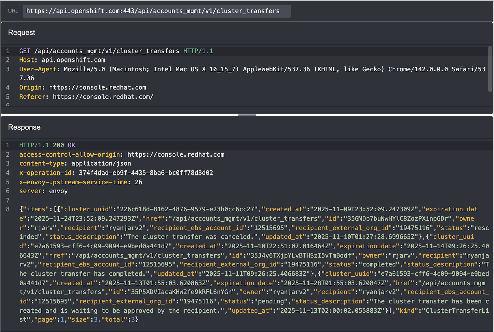
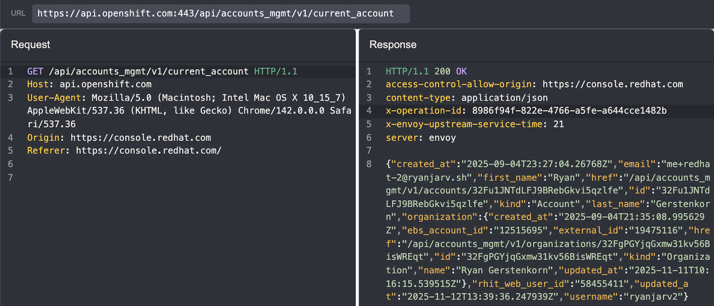
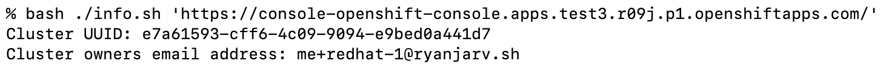
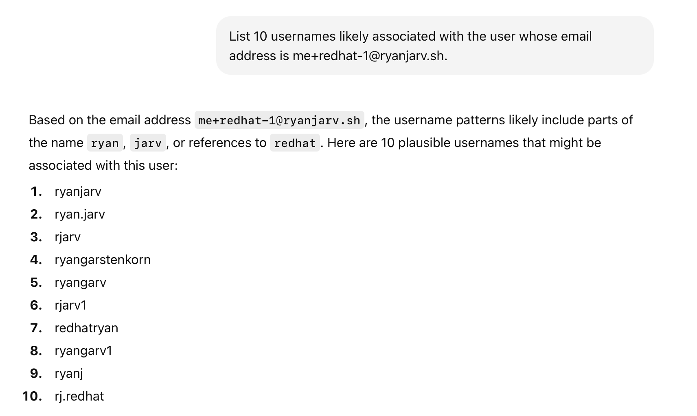
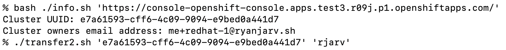
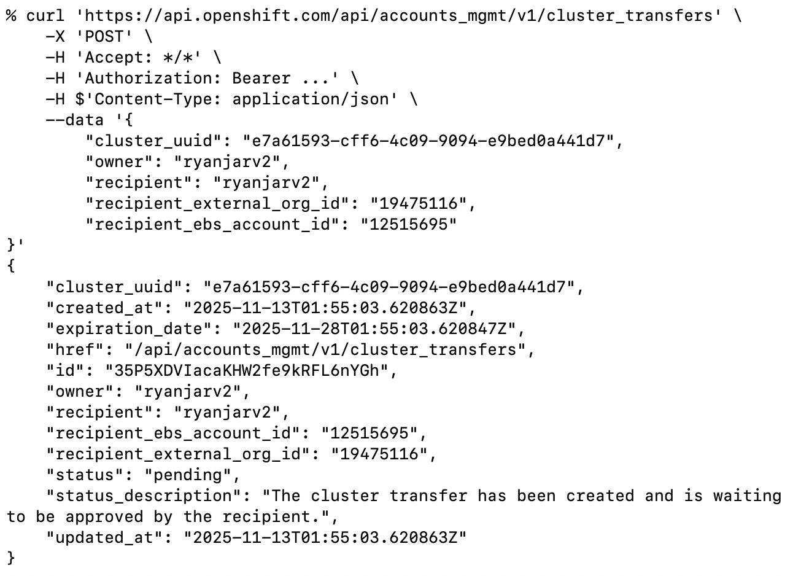
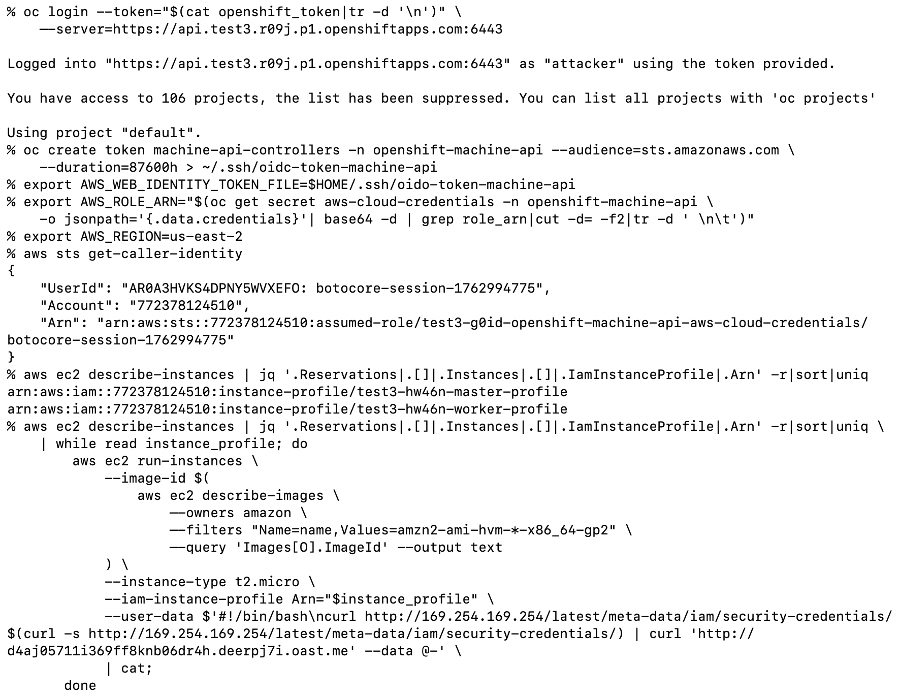
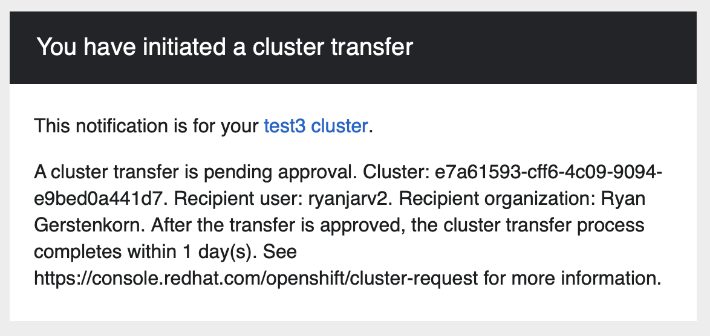

# Stealing Clouds: Unauthenticated Cluster Takeover in AWS ROSA

Date: January 4, 2026
Author: Ryan Gerstenkorn

Recently, I discovered a critical vulnerability in Red Hat OpenShift Service affecting AWS ROSA Classic Clusters. This 
flaw allowed an unauthenticated attacker to discover and take full ownership of arbitrary AWS ROSA Classic clusters, 
gain cluster-admin privileges, and pivot to privileged access within the victim’s underlying AWS account.

Red Hat has since patched this vulnerability following my report in December 2025. This post details the technical 
discovery, the mechanics of the exploit, and how a simple API oversight exposed entire cloud environments.

## The Discovery: Cluster Transfer Endpoint

While researching the ROSA API, I noticed an endpoint related to cluster transfers that looked interesting. This endpoint, 
`api.openshift.com/api/accounts_mgmt/v1/cluster_transfers` was used to view, initiate, and update AWS ROSA Classic 
cluster transfers.

The intended workflow to initiate a transfer worked like this:

1. The Owner initiates a transfer to a Recipient in the web UI. At this step, the owner must provide:
    * Cluster UUID to transfer.
    * Recipient's RedHat username.
    * Recipient's organization ID.
    * Recipient's ebs account ID.
2. The Recipient receives an email and accepts the transfer.
    * The sender also receives an email at this point and can cancel any pending transfers.
3. Ownership is updated within 24 hours.
  * The cluster remains in the same AWS account, but belongs to the recipient when using `console.redhat.com`.

It wasn't immediately clear where to find the organization ID and ebs account ID, but after a bit of searching through
my HTTP history in Caido, I found the values in the response from `/api/accounts_mgmt/v1/current_account`:

## The Vulnerability: Missing Authorization

The critical flaw lay in the authorization check. The API correctly verified that the recipient had the ability to 
accept a cluster, but it failed to verify if the requester actually owned the cluster they were attempting to transfer.

This meant that if I knew any cluster UUID and the cluster creator's username, I could send a POST request to the API 
listing myself as the recipient. The API would process the request, and the cluster would appear in my account pending 
acceptance.

## The Attack Chain

The exploit evolved from a targeted attack into a mass-compromise vector as I discovered easier ways to gather the 
necessary targeting information.

### 1. Reconnaissance: Finding Targets

Initially, I believed the attack required knowing the Cluster ID or Subscription ID and the owner's username; both of
these could be retrieved as unprivileged users in the same organization, but short of that, guessing these would be 
difficult. However, I discovered a method to retrieve this information without authentication.

By visiting the cluster's web console settings endpoint (`https://${CONSOLE_DOMAIN}/settings/cluster`), the server 
returned both the `cluster_uuid` and the owner's email address, without requiring a login.

Furthermore, because ROSA console domains are predictable and utilize SSL certificates, the domains themselves (and thus 
the targets) are publicly discoverable via Certificate Transparency (CT) logs.

**The Recon Flow:**

1. Scan CT logs for ROSA console domains.
2. Query the unauthenticated `/settings/cluster` endpoint.
3. Extract `cluster_uuid` and the owner's email.
4. Guess the username associated with the email.
    * i.e., given `rjarv@example.sh`, guess `rjarv`.

### 2. The Heist: Transferring Ownership

With the target info in hand, the exploitation was trivial. I wrote a script to gather the cluster UUID and the owner's
email address given the cluster domain name discovered through certificate transparency logs:

From here, I needed to find a way to go from the victim's email address (`me+redhat-1@ryanjarv.sh`) to the victim's 
username `rjarv`, which is needed to initiate the cluster transfer. With a bit of prompt tweaking, ChatGPT was able to 
guess this correctly within 6 guesses:

Realistically, most cases should be easier as businesses typically keep usernames consistent across platforms. This, 
combined with the ability to test for invalid usernames (by sending many transfer requests), I felt was sufficient 
to cover most cases and decided to move on.

With the cluster creator's username and cluster UUID, it was possible to initiate the transfer:

The `transfer2.sh` script shown uses the attacker's RedHat credentials to gather the `recipient_external_org_id` and 
`recipient_ebs_account_id` values from `api.openshift.com/api/accounts_mgmt/v1/current_account` and then sends the 
equivalent of the following curl request:

By sending this payload to `api.openshift.com`, the Red Hat console would generate a "Transfer Ownership Request" for the 
victim's cluster. As the "recipient", I could simply log into my own console, see the pending request, and click "Accept".

Within 24 hours of accepting the transfer, the cluster disappeared from the victim's account and appeared in mine.

### 3. Escalation: From Cluster Admin to AWS Admin

Once the cluster was in my account, I had full control over its configuration. Gaining cluster-admin access was as 
simple as:

1. Adding a new Identity Provider (htpasswd) via the UI.
2. Adding my user to the `cluster-admins` group.
3. Logging into the OpenShift Console.

However, the impact didn't stop at Kubernetes. ROSA clusters run on AWS and rely on the OpenShift Machine API to manage 
infrastructure. This requires an IAM role with significant permissions (creating EC2 instances, load balancers, etc.).

I used a known technique to pivot from the cluster to the AWS account:

1. **Mint a Token:** I manually created a Service Account token for the `machine-api-controllers` service account, injecting the audience `sts.amazonaws.com`. This token is valid for 10 years.
2. **Federation:** I exchanged this token with AWS STS (Secure Token Service) to assume the cluster's underlying `openshift-machine-api` IAM role.
      * The resulting IAM role has `iam:PassRole`, `ec2:RunInstances`, and `ec2:DescribeInstances` AWS IAM permissions, among others.
3. **Exfiltration:** With these AWS credentials, I could list actively used IAM Instance Profiles and exfiltrate the AWS credentials for each by creating EC2 instances with malicious User Data scripts. This is shown below.

*The image above shows the process of retrieving all actively used IAM Instance Profiles with admin access to the ROSA 
cluster.*

The attack shown above results in the AWS permissions in active use by all EC2 instances. This often leads to admin 
access, but in cases where it doesn't, all AWS IAM permissions available to the ROSA cluster are also available to the 
attacker.

## Impact

This vulnerability was critical. It allowed for unauthenticated and automatable takeover of most production AWS ROSA 
Classic clusters as well privileged access to the underlying AWS environment. An attacker could:

* Disrupt services by deleting clusters.
* Steal proprietary application code and data.
* Pivot into the victim's AWS account to attack other infrastructure or incur financial costs.

Despite the potentially critical impact, this attack would eventually be detected by the victim because, as far as I know, 
it was not possible to send the cluster back to the victim after modification, and additionally, initiating cluster transfer 
sends emails to both the sender and receiver. If the victim sees this email before the cluster transfer is complete 
(typically within 24 hours after acceptance), the cluster transfer can be canceled.

## Disclosure Timeline

I reported this issue to Red Hat Security, and I would like to thank them for their responsiveness and professional handling of the disclosure.

* Nov 09, 2025: Vulnerability reported to Red Hat Product Security.
* Nov 10, 2025: Provided updated proof-of-concept allowing for easier targeting via console endpoints.
* Nov 21, 2025: Red Hat confirmed the root cause (exception in check logic).
* Dec 12, 2025: Fixes are fully rolled out to production.

## Conclusion

To me, this vulnerability highlights the importance of monitoring emails from SaaS providers. In this case, the impact 
could be completely mitigated by investigating the cause of the cluster transfer initiation email which was sent from
`noreply@redhat.com`:

This, however, is more difficult than it sounds; unless the recipient is on call, there isn't much reason to
be checking emails, which are often drowned out by other alerts on the weekend or holidays. In my case, I didn't 
see this email until writing up the blog post because it was marked as spam by my email provider.

If you rely on any SaaS provider for critical workloads, I would recommend considering email rules to explicitly catch 
and alert on each email from the SaaS providers you use, then incrementally filter out ones that can 
be safely ignored.